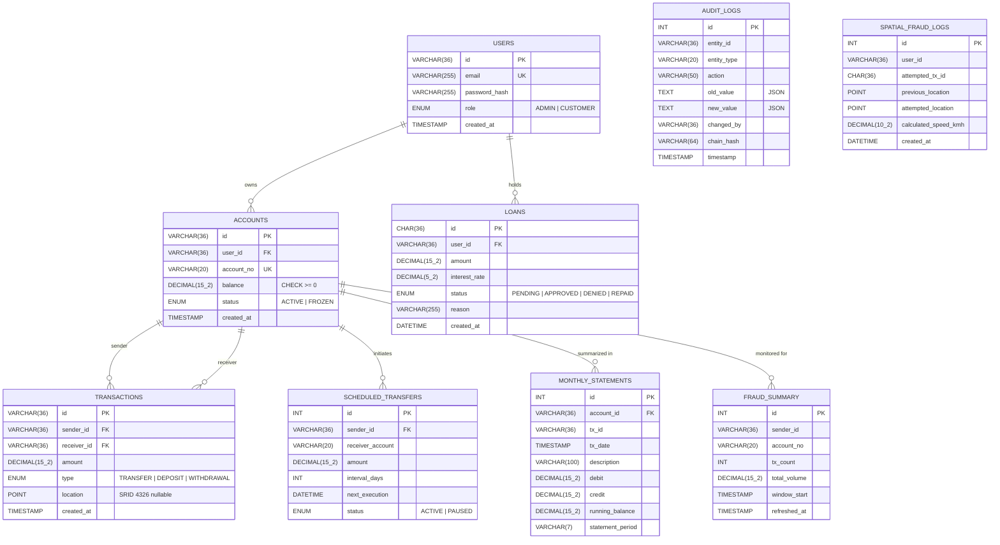

<div align="center">

# 🛡️ FORTRESS LEDGER

**Enterprise-Grade Banking & Forensic Fraud Analytics Engine**


> **"In digital finance, 'close enough' is a catastrophe. We built Fortress Ledger because your data integrity shouldn't depend on luck — it should be enforced by the absolute laws of ACID compliance, Row-Level Locking, and Forensic Auditing."**

[](https://reactjs.org/)
[](https://nodejs.org/)
[](https://www.mysql.com/)
[](https://tailwindcss.com/)
[](LICENSE)

</div>

---

## 🔴 The Problem — Why Fortress Ledger Exists

Most "banking" applications are dangerously fragile. They treat financial transactions as simple CRUD operations. If a server crashes mid-transfer or two users withdraw simultaneously, balances drift, audit logs vanish, and system integrity collapses.

| The Gap | The Consequence |
|---|---|
| **Race Conditions** | Two concurrent withdrawals both pass the balance check → double-spend |
| **Forensic Void** | Standard logs say *who* logged in, not *what changed* at the row level |
| **Fragmented Security** | No Row-Level Security → horizontal privilege escalation |
| **Missing Fraud Detection** | No velocity analysis → bots drain accounts undetected |

---

## ⚡ The Solution

Fortress Ledger moves the source of truth from the fragile application layer back into the hardened DBMS. Every critical operation — locking, auditing, fraud detection, loan underwriting — is enforced at the database level where it cannot be bypassed.

| The Gap | How Fortress Ledger Closes It |
|---|---|
| **Race Conditions** | `SERIALIZABLE` isolation + `FOR UPDATE` row-level locking |
| **Forensic Void** | `AFTER INSERT/UPDATE` triggers write immutable JSON row-diffs with a SHA-256 hash chain |
| **Fragmented Security** | JWT HttpOnly cookies + RBAC + `CHECK (balance >= 0)` at the schema level |
| **Fraud Detection** | Spatial impossible-travel trigger + fraud velocity materialized view + scheduled event refresh |

---

## ✨ Core Features

### 💎 Atomic Transfer Engine
- `SERIALIZABLE` isolation prevents all phantom reads and double-spends
- Canonical lock ordering (lower UUID first) eliminates deadlocks mathematically
- `sp_atomic_transfer` stored procedure: 1 network call instead of 6+ queries
- Full ROLLBACK on any failure — money is never partially moved

### 🔍 Forensic Audit System
- Trigger-based auditing on every INSERT/UPDATE across `users`, `accounts`, `transactions`
- Full JSON row-diffs (`old_value` / `new_value`) captured automatically
- SHA-256 chained hash on every audit row — retroactive tampering is detectable
- Audit logs fire even from direct console access — impossible to bypass

### 🌍 Spatial Impossible-Travel Detection
- Every transaction optionally carries a GPS `POINT` location (SRID 4326)
- `trg_impossible_travel` trigger calculates speed between consecutive transactions using `ST_Distance_Sphere`
- Transactions implying movement faster than 1,200 km/h are blocked at the DB level with `SIGNAL SQLSTATE`
- All blocked attempts logged to `spatial_fraud_logs` for forensic review

### 🤖 Algorithmic Loan Underwriting
- Heuristic credit scoring based on account balance and 90-day transaction volume
- Scores below threshold → auto-denied immediately by the algorithm
- Scores above threshold → `PENDING` state, forwarded to admin for manual sign-off
- `sp_approve_loan` mints capital via a `NULL`-sender `DEPOSIT` transaction (central bank model)

### 📅 Scheduled Recurring Transfers
- `scheduled_transfers` table stores recurring payment rules
- `sp_process_scheduled_transfers` cursor-based procedure bulk-processes all due payments
- MySQL Event Scheduler fires every minute — fully automatic, zero app-layer involvement
- Failed transfers (insufficient funds, frozen account) auto-pause the schedule

### 📊 Fraud & Liquidity War Room
- `vw_fraud_velocity`: accounts with >10 transactions or >$50,000 volume in the last hour
- `fraud_summary` materialized table refreshed every 60 seconds via scheduled event
- `vw_global_liquidity`: total circulating capital across all active accounts
- Admin instant kill-switch to freeze any account

### 📋 Monthly Statement Engine
- `sp_generate_monthly_statement` uses a cursor to build a running balance row by row
- Opening balance reconstructed from all prior transaction history
- Statement written to `monthly_statements` table and returned in a single procedure call

---

## 🛠️ Tech Stack

| Layer | Technology | Purpose |
|---|---|---|
| **Frontend** | React 18 + Vite | Fast SPA with sub-millisecond transitions |
| **Styling** | Tailwind CSS | Midnight dark palette with Emerald accents |
| **Charts** | Recharts | Real-time liquidity and fraud velocity graphs |
| **Animations** | Framer Motion | Smooth state transitions |
| **Backend** | Node.js + Express | REST API with manual transaction management |
| **Database** | MySQL 8.0 | ACID-compliant core with triggers, procedures, events |
| **DB Driver** | mysql2/promise | High-performance async connection pooling |
| **Auth** | JSON Web Tokens | Role-specific access, 1h TTL, HttpOnly cookies |

---

## 🏗️ System Architecture

```
┌──────────────────────────────────────────────────────────────────┐
│                       CLIENT LAYER (React)                       │
├───────────────┬──────────────┬───────────────┬───────────────────┤
│  Landing.jsx  │ Dashboard.jsx│   Admin.jsx   │ AdminUserDetail   │
│  Login.jsx    │ Profile.jsx  │               │ .jsx              │
└──────┬────────┴──────┬───────┴──────┬────────┴────────┬──────────┘
       │               │              │                 │
       ▼               ▼              ▼                 ▼
┌──────────────────────────────────────────────────────────────────┐
│                    EXPRESS BACKEND (Node.js)                      │
│                                                                  │
│  /api/auth      /api/banking      /api/admin      /api/profile   │
│                                                                  │
│  ┌───────────────────────────────────────────────────────────┐   │
│  │  Middleware: authMiddleware → rateLimiter → validate      │   │
│  └───────────────────────────────────────────────────────────┘   │
│                                                                  │
│  authController   bankingController   adminController            │
│  profileController                                               │
└────────────────────────────┬─────────────────────────────────────┘
                             │  mysql2/promise pool
                             ▼
┌──────────────────────────────────────────────────────────────────┐
│                      DATABASE LAYER (MySQL 8)                    │
│                                                                  │
│  Tables: users, accounts, transactions, audit_logs, loans,       │
│          scheduled_transfers, spatial_fraud_logs,                │
│          fraud_summary, monthly_statements                       │
│                                                                  │
│  Triggers: trg_audit_chain_hash, trg_audit_accounts_update,      │
│            trg_audit_accounts_insert, trg_audit_transactions,    │
│            trg_audit_users_insert/update, trg_impossible_travel  │
│                                                                  │
│  Procedures: sp_atomic_transfer, sp_generate_monthly_statement,  │
│              sp_process_scheduled_transfers, sp_request_loan,    │
│              sp_approve_loan                                     │
│                                                                  │
│  Views: vw_fraud_velocity, vw_global_liquidity,                  │
│         vw_customer_accounts, vw_customer_transactions           │
│                                                                  │
│  Events: evt_refresh_fraud_stats, evt_process_scheduled_transfers│
└──────────────────────────────────────────────────────────────────┘
```

---

## 📁 Project Structure

```
DBMS - Fortress Ledger/
├── client/                          # React 18 frontend
│   ├── public/
│   │   ├── favicon.svg
│   │   └── icons.svg
│   └── src/
│       ├── api/
│       │   └── axios.js             # Axios instance with base URL + credentials
│       ├── components/
│       │   ├── ui/
│       │   │   ├── Navbar.jsx       # Role-aware navigation
│       │   │   ├── Footer.jsx
│       │   │   ├── GlassCard.jsx    # Reusable glass-morphism card
│       │   │   └── Loader.jsx
│       │   ├── BatchTransferModal.jsx
│       │   ├── LockMatrix.jsx
│       │   └── ProtectedRoute.jsx   # RBAC route guard
│       ├── context/
│       │   ├── AuthContext.jsx      # Global login/role state
│       │   ├── SocketContext.jsx    # Real-time socket connection
│       │   └── ThemeContext.jsx
│       └── pages/
│           ├── Landing.jsx
│           ├── Login.jsx
│           ├── Register.jsx
│           ├── Dashboard.jsx        # Customer panel
│           ├── Profile.jsx
│           ├── Admin.jsx            # Security war room
│           ├── AdminUserDetail.jsx
│           └── NotFound.jsx
│
├── server/                          # Node.js + Express backend
│   ├── config/
│   │   └── db.js                    # mysql2 connection pool
│   ├── controllers/
│   │   ├── authController.js        # Login, register, JWT
│   │   ├── bankingController.js     # Transfers, statements, loans
│   │   ├── adminController.js       # Dashboard, audit, freeze
│   │   └── profileController.js    # Profile management
│   ├── middleware/
│   │   ├── authMiddleware.js        # JWT validation + RBAC
│   │   ├── rateLimiter.js           # Brute-force protection
│   │   ├── validate.js              # Request body validation
│   │   └── errorHandler.js
│   ├── routes/
│   │   ├── authRoutes.js
│   │   ├── bankingRoutes.js
│   │   └── adminRoutes.js
│   ├── schema.sql                   # ← Full consolidated schema (all phases)
│   ├── scratch_reset.js             # Drops and rebuilds the entire DB
│   ├── .env.example
│   └── server.js                    # App entry point
│
├── DBMS_DEEP_DIVE.md                # Engineering reference & viva prep
└── README.md
```

---

## 🗄️ Database Schema



---

## 🔌 API Reference

| Method | Endpoint | Access | Description |
|---|---|:---:|---|
| `POST` | `/api/auth/register` | Public | Create account + generate JWT |
| `POST` | `/api/auth/login` | Public | Authenticate + set HttpOnly cookie |
| `POST` | `/api/auth/logout` | Auth | Clear session cookie |
| `GET` | `/api/banking/dashboard` | Customer | Account balance + recent transactions |
| `POST` | `/api/banking/transfer` | Customer | Atomic transfer via `sp_atomic_transfer` |
| `GET` | `/api/banking/statement` | Customer | Monthly statement via cursor procedure |
| `POST` | `/api/banking/loan/request` | Customer | Submit loan via `sp_request_loan` |
| `GET` | `/api/profile` | Customer | Profile details |
| `GET` | `/api/admin/dashboard` | Admin | Global stats from `vw_global_liquidity` |
| `GET` | `/api/admin/fraud` | Admin | Flagged accounts from `fraud_summary` |
| `GET` | `/api/admin/audit` | Admin | Forensic audit log with chain hash |
| `PATCH` | `/api/admin/freeze/:id` | Admin | Instant account freeze |
| `GET` | `/api/admin/loans` | Admin | Pending loan queue |
| `POST` | `/api/admin/loans/:id/approve` | Admin | Approve via `sp_approve_loan` |
| `GET` | `/api/admin/users` | Admin | All users with account details |

---

## 🚀 Getting Started

### Prerequisites

- Node.js 18+
- MySQL 8.0+ (spatial functions and `ST_Distance_Sphere` required)
- npm

### 1. Clone the repository

```bash
git clone https://github.com/yourusername/fortress-ledger.git
cd fortress-ledger
```

### 2. Install dependencies

```bash
# Install server dependencies
cd server && npm install

# Install client dependencies
cd ../client && npm install
```

### 3. Configure environment

Copy `.env.example` to `.env` in the `server/` directory:

```env
DB_HOST=localhost
DB_PORT=3306
DB_USER=root
DB_PASS=yourpassword
DB_NAME=fortress_ledger
JWT_SECRET=your_super_secret_key_min_32_chars
PORT=5000
NODE_ENV=development
```

### 4. Initialize the database

```bash
# From the server/ directory
mysql -u root -p < schema.sql
```

This single file creates the database, all tables, indexes, triggers, stored procedures, views, and scheduled events in the correct dependency order.

### 5. (Optional) Reset to a clean state

```bash
# From the server/ directory
node scratch_reset.js
```

This drops and fully rebuilds the `fortress_ledger` database. Useful between demo runs.

### 6. Start the application

```bash
# Terminal 1 — backend
cd server && npm run dev

# Terminal 2 — frontend
cd client && npm run dev
```

The client runs at `http://localhost:5173`, the server at `http://localhost:5000`.

---

## 🎨 Design System

| Token | Hex | Usage |
|---|---|---|
| `--bg-main` | `#0A0F1E` | Main backdrop |
| `--surface` | `#111827` | Panel / card background |
| `--emerald` | `#10B981` | Positive balance, success states |
| `--danger` | `#EF4444` | Fraud alert, frozen, negative |
| `--primary` | `#00D4FF` | Branding, active highlights |

---

## 🏆 In One Line

> **"Every app lets you move data. Fortress Ledger ensures you never lose the truth."**

---

## 📄 License

MIT — see [LICENSE](LICENSE).