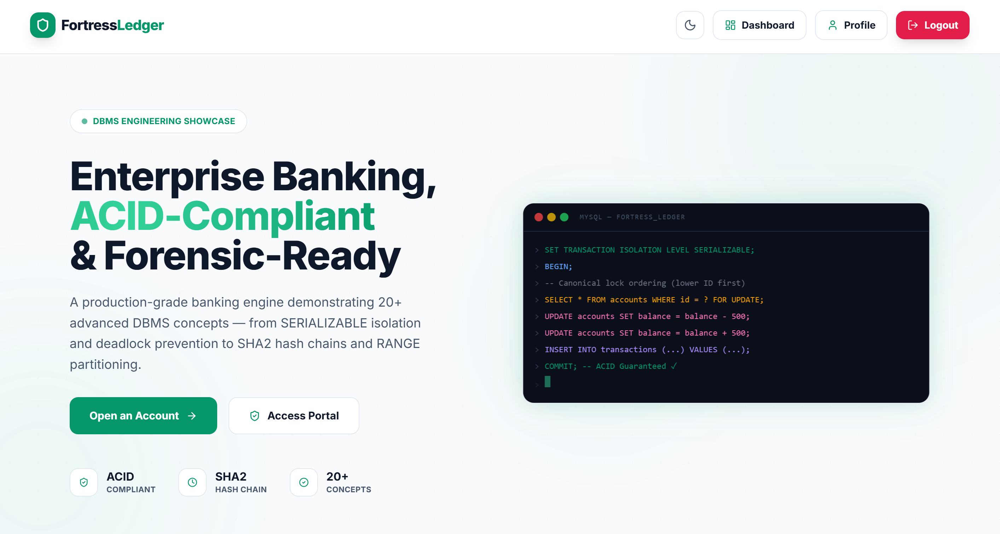
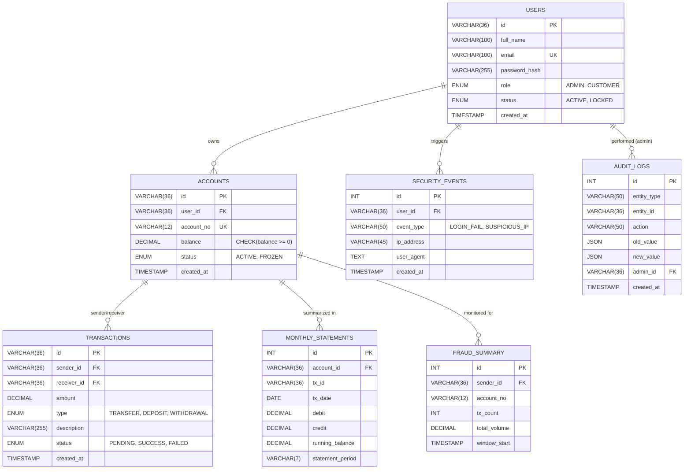

<div align="center">

# 🛡️ FORTRESS LEDGER

**Enterprise-Grade Banking & Forensic Fraud Analytics Engine**



> **"In digital finance, 'close enough' is a catastrophe. We built Fortress Ledger because your data integrity shouldn't depend on luck. It should be enforced by the absolute laws of ACID compliance, Row-Level Locking, and Forensic Auditing."**

<a href="#" target="_blank">
  
</a>

[](https://www.mongodb.com/)
[](https://reactjs.org/)
[](https://nodejs.org/)
[](https://www.mysql.com/)
[](https://tailwindcss.com/)
[](/)

</div>

---

## 🔴 The Problem — Why Fortress Ledger Exists

In the world of professional digital finance, most "banking" applications are dangerously fragile. They treat financial transactions as simple CRUD operations. If a server crashes mid-transfer or two users withdraw simultaneously, balances drift, audit logs disappear, and system integrity collapses.

### The Integrity Gap

**1. The "Race Condition" Nightmare**

Standard application layers are fundamentally too slow to catch sub-millisecond race conditions. Without strict `SERIALIZABLE` isolation at the database level, concurrent requests can trigger "double-spending"—allowing a user to withdraw more money than they actually possess because the system hasn't finished updating the balance from the first request.

**2. The Forensic Void**

When a discrepancy occurs, standard logs are almost always insufficient. They tell you *who* logged in, but not exactly *what* the row state was before and after a split-second modification. Without an immutable, trigger-based forensic engine, reconstructing a high-fidelity audit trail for compliance is impossible.

**3. Fragmented Security & RBAC**

Securing a financial platform requires more than just a login page. Most systems fail at Row-Level Security (RLS) and multi-factor validation, leaving horizontal privilege escalation as a constant threat. Independent analysts and security auditors lack a unified "War Room" interface to monitor global liquidity and fraud velocity in real-time.

**4. The Compliance Paywall**

Enterprise-grade banking core systems cost millions. Small institutions, fintech startups, and data science students are locked out of high-fidelity DBMS environments, creating a massive knowledge gap in how mission-critical financial software is actually built.

---

## ⚡ The Solution — Fortress Ledger

Fortress Ledger is a transaction-first, ACID-compliant financial ecosystem that eliminates these failure points through rigorous relational logic and real-time forensic analytics.

| The Gap | How Fortress Ledger Closes It |
|---------|----------------------|
| **Race Conditions** | `SERIALIZABLE` Isolation + `FOR UPDATE` Row-Level Locking ensures zero double-spending |
| **Forensic Void** | Database-level `AFTER UPDATE` Triggers capture immutable state snapshots automatically |
| **Fragmented Security**| Centralized RBAC + JWT Http-Only cookies + Database `CHECK` constraints (No negative balances) |
| **Compliance Paywall** | Open-source enterprise architecture. $0 to run. Professional-grade auditing democratized |

---

## 🎯 What Makes Fortress Ledger Different

Unlike standard MERN apps, Fortress Ledger moves the "Source of Truth" from the fragile application layer back into the hardened Database Management System (DBMS). It implements **Double-Entry Bookkeeping** logic at the core.

```
Request Transfer $100  →  Verify Sender ACTIVE  →  Lock Rows (FOR UPDATE)
Update Sender (-100)   →  Update Receiver (+100) →  Log Audit Snapshot
Verify Balance >= 0    →  INSERT Transaction    →  COMMIT / ROLLBACK
```

### Competitor Comparison

| Capability | Basic CRUD App | Typical Fintech SPA | **Fortress Ledger** |
|------------|:-:|:-:|:-:|
| Atomic Transfers | ❌ | ⚠️ (App-level) | ✅ (DB-level) |
| Row-Level Locking | ❌ | ❌ | ✅ |
| Immutable Audit Triggers | ❌ | ❌ | ✅ |
| **Fraud Velocity Analytics** | ❌ | ⚠️ | ✅ |
| **Real-Time Forensic Dash** | ❌ | ❌ | ✅ |
| **ACID Compliance** | ❌ | ✅ | ✅ |
| **Double-Entry Logic** | ❌ | ❌ | ✅ |
| **Negative Balance Block** | ❌ | ❌ | ✅ |

---

## ✨ Core Features

### 💎 Feature 1 — Atomic Transfer Engine *(The Core Integrity)*

The engine that ensures money is never lost or duplicated. Fortress Ledger uses manual transaction management to guarantee atomicity.

| Capability | Description |
|------------|-------------|
| **SERIALIZABLE Isolation** | Highest SQL isolation level to prevent all possible race conditions and phantoms |
| **Pessimistic Locking** | Uses `SELECT ... FOR UPDATE` to block other transactions from reading/writing the same row during a move |
| **Rollback Recovery** | Any failure in the multi-step ledger entry triggers an instant 100% database rollback |
| **Atomic Transfers** | Executes Sender, Receiver, and Transaction Log updates as a single indivisible unit |

---

### 🔍 Feature 2 — Forensic Audit Engine

A background surveillance system that never sleeps. Using database triggers, Fortress Ledger records every heartbeat of the financial system.

| Capability | Description |
|------------|-------------|
| **`AFTER UPDATE` Triggers** | Automatically fires on any balance change, bypassing application code entirely |
| **Immutable Logs** | Audit records are stored in a separate table with zero DELETE permissions for the application user |
| **State Snapshots** | Captures `old_value` and `new_value` for every modified row for point-in-time recovery analysis |
| **Admin Traceability** | Logs the `admin_id` responsible for manual freezes or overrides |

---

### 📊 Feature 3 — Fraud & Liquidity War Room

A high-fidelity administrative dashboard providing situational awareness for security officers.

| Capability | Description |
|------------|-------------|
| **Fraud Velocity View** | SQL Window Functions calculate transactions per minute to flag bot activity |
| **Global Liquidity Scan** | Real-time aggregation of total circulating capital vs. reserved assets |
| **Real-Time Visualization** | Recharts `AreaChart` and `BarChart` for volume trend analysis |
| **Instant Kill-Switch** | Admin can `FREEZE` any account instantly, blocking all incoming/outgoing transfers |
| **Audit Navigator** | Searchable forensic timeline of all system-wide financial movements |

---

### 🔐 Feature 4 — Multi-Layered Security (RBAC)

Enterprise-grade access control ensuring that even with a breach, the core data remains protected.

| Capability | Description |
|------------|-------------|
| **JWT Http-Only Cookies** | Tokens stored in non-JS-accessible cookies to prevent XSS attacks |
| **Role-Based Access** | Strictly segregated routes for `CUSTOMER` vs. `ADMIN` roles |
| **Password Hashing** | Argon2/Bcrypt hash-and-salt methodology for all credentials |
| **Rate Limiting** | brute-force protection on all auth and banking endpoints |

---

## 🛠️ Tech Stack

### Frontend


### Backend


| Layer | Technology | Purpose |
|-------|-----------|---------|
| **Frontend Framework** | React 18 + Vite | Fast Dashboard — sub-millisecond page transitions |
| **Styling** | Tailwind CSS | Slate-900 "Midnight" palette with Emerald-600 accents |
| **Charts** | Recharts | Real-time liquidity and fraud velocity graphs |
| **Animations** | Framer Motion | Smooth state transitions and SVG typewriters |
| **Backend** | Node.js + Express | REST server with manual transaction pool |
| **Database** | MySQL 8.0 | ACID-compliant relational core with triggers & views |
| **ORM/Driver** | mysql2/promise | High-performance async connection pooling |
| **Authentication** | JSON Web Tokens | Role-specific access with 1h TTL |

---

## 🏗️ System Architecture

```
┌─────────────────────────────────────────────────────────────────┐
│                         CLIENT LAYER (React)                    │
├──────────────┬──────────────┬──────────────┬────────────────────┤
│ Customer Pan │ Admin Console│ Fraud Radar  │ Forensic Audit UI  │
└──────┬───────┴──────┬───────┴──────┬───────┴────────┬───────────┘
       │              │              │                │
       ▼              ▼              ▼                ▼
┌─────────────────────────────────────────────────────────────────┐
│                    EXPRESS BACKEND (Node.js)                     │
│                                                                 │
│  /api/auth       /api/banking       /api/admin                  │
│                                                                 │
│  ┌───────────────────────────────────────────────────────────┐  │
│  │  AtomicTransfer.js — Logic Layer                         │  │
│  │  Lock → Validate → Update S → Update R → Commit          │  │
│  └───────────────────────────────────────────────────────────┘  │
│                                                                 │
│  ┌───────────────────┐   ┌─────────────────────────────────┐   │
│  │  Middleware       │   │  DB Connection Pool             │   │
│  │  (Auth / RBAC)    │   │  mysql2/promise                 │   │
│  └───────────────────┘   └─────────────────────────────────┘   │
└─────────────────────────────┬───────────────────────────────────┘
                              │  SQL Protocol
                              ▼
┌─────────────────────────────────────────────────────────────────┐
│                     DATABASE LAYER (MySQL)                      │
│                                                                 │
│  ┌─ Tables ─────────────────┐  ┌─ Objects ────────────────────┐ │
│  │  users, accounts         │  │  trg_audit_balance (Trigger) │ │
│  │  transactions            │  │  vw_fraud_velocity (View)    │ │
│  │  audit_logs              │  │  sp_monthly_stmt (Procedure) │ │
│  └──────────────────────────┘  └──────────────────────────────┘ │
└─────────────────────────────────────────────────────────────────┘
```

---

## 📁 Project Structure

```
FortressLedger/
├── client/                                  # ⚛️ React 18 Frontend
│   ├── src/
│   │   ├── components/
│   │   │   ├── Navbar.jsx                   # 🧭 Logo, Navigation, Role-based links
│   │   │   ├── BalanceCard.jsx              # 💳 Real-time balance SVG card
│   │   │   ├── TransactionList.jsx          # 📜 Recent activity table
│   │   │   ├── AdminDashboard.jsx           # 🛡️ Global stats & fraud radar
│   │   │   ├── FraudAlerts.jsx              # 🚩 Flagged high-velocity accounts
│   │   │   └── AuditTrail.jsx               # 🔍 Forensic log explorer
│   │   ├── context/
│   │   │   ├── AuthContext.jsx              # 🔐 global login/role state
│   │   │   └── SocketContext.jsx            # 📡 Real-time updates
│   │   ├── pages/
│   │   │   ├── Dashboard.jsx                # Main landing for customers
│   │   │   ├── Login.jsx                    # Secure entry
│   │   │   └── Admin.jsx                    # Security "War Room"
│   │   └── index.css                        # Tailwind + Proxima-inspired UI
│
├── server/                                  # 🖥️ Node.js + MySQL Backend
│   ├── config/
│   │   └── db.js                            # mysql2 connection pooling
│   ├── controllers/
│   │   ├── authController.js                # Login, Register, JWT Set
│   │   ├── bankingController.js             # ATOMIC Transfer logic
│   │   └── adminController.js               # Dashboard & Audit retrieval
│   ├── middleware/
│   │   └── authenticate.js                  # JWT validation & RBAC
│   ├── routes/
│   │   ├── authRoutes.js
│   │   ├── bankingRoutes.js
│   │   └── adminRoutes.js
│   ├── advanced_schema.sql                  # 🏛️ Full Triggers, Views, & Sp's
│   ├── server.js                            # App entry point
│   └── package.json
└── README.md
```

---

## 🏛️ Database Architecture & Reverse Engineered Diagram

Fortress Ledger's relational integrity is enforced by a strictly normalized schema, optimized for forensic traceability.



---

## 🔌 API Routes

| Method | Endpoint | Access | Description |
|--------|----------|:---:|-------------|
| `POST` | `/api/auth/login` | Public | Auth & set Http-Only cookie |
| `POST` | `/api/banking/transfer`| Customer| **ATOMIC** transfer with row-locking |
| `GET` | `/api/admin/dashboard` | Admin | Global stats from `vw_global_liquidity` |
| `GET` | `/api/admin/fraud` | Admin | Flagged users from `vw_fraud_velocity` |
| `PATCH`| `/api/admin/freeze/:id`| Admin | Instant account lock-down |
| `GET` | `/api/admin/audit` | Admin | Raw forensic log retrieval |

---

## 🎨 Design System

Fortress Ledger uses a **"Midnight Professional"** palette—designed to minimize eye strain during forensic analysis while highlighting critical alerts.

| Token | Hex | Usage |
|-------|-----|-------|
| `--bg-main` | `#0A0F1E` | Main backdrop |
| `--surface` | `#111827` | Panel background |
| `--emerald` | `#10B981` | Success / Positive balance |
| `--danger` | `#EF4444` | Fraud Alert / Frozen / Negative |
| `--primary` | `#00D4FF` | Branding / Active highlights |

---

## 🚀 Getting Started

### 1. Clone & Install
```bash
git clone https://github.com/yourusername/fortress-ledger.git
cd fortress-ledger
npm run install-all
```

### 2. Database Initialization
1. Create a MySQL database named `fortress_ledger`.
2. Run the SQL script found in `server/advanced_schema.sql`.

### 3. Environment Setup
Create a `.env` in the `server/` directory:
```env
DB_HOST=localhost
DB_USER=root
DB_PASS=yourpassword
DB_NAME=fortress_ledger
JWT_SECRET=supersecret
PORT=5000
```

### 4. Launch
```bash
# From root
npm run dev
```

---

## 🏆 The Pitch in One Line

> **"Every app lets you move data. Fortress Ledger ensures you never lose the truth."**

`MERN` · `MySQL` · `ACID Compliant` · `Forensic Quality`

---

## 📄 License

This project is available under the [MIT License](LICENSE).

---

## 👨‍💻 Team

<div align="center">

**Built with ❤️ for Financial Integrity**

[](https://github.com/yourusername)

</div>